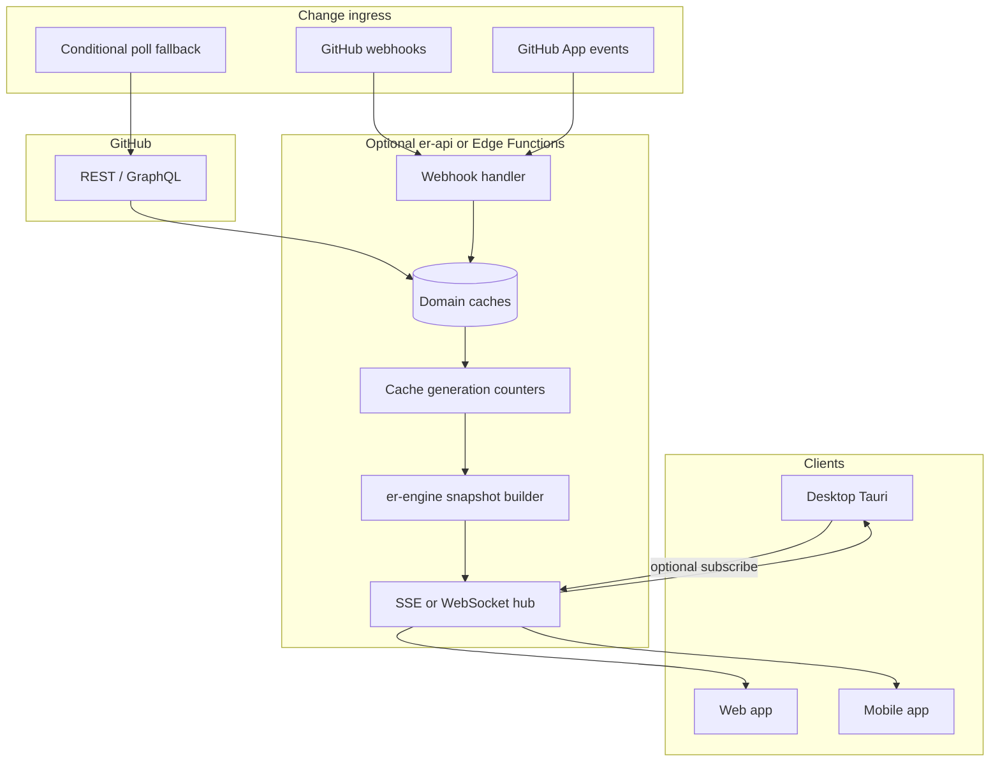

# GitHub sync architecture (future)

> **Status:** Deferred — design reference for web/mobile and eventual desktop API path.  
> **Last updated:** 2026-05-25  
> **Related:** [mobile-port.md](./mobile-port.md), [platform-strategy.md](./platform-strategy.md), idle CPU plan (profile log May 2026)

Desktop today uses the **`gh` CLI** ([`crates/er-engine/src/github.rs`](../crates/er-engine/src/github.rs)) and **timer-driven caches** ([`crates/er-desktop/src/pr_cache.rs`](../crates/er-desktop/src/pr_cache.rs), `gh_status_cache`, meta git sweep in [`main.rs`](../crates/er-desktop/src/main.rs)). Web and mobile **cannot** rely on `gh`; they need token-based GitHub API access and a sync model that does not poll the world every few seconds.

This document describes a target **event-driven + cache** design. It is **not** implemented yet. Near-term desktop idle-CPU fixes (decouple meta from snapshot revision, slow meta loop, preserve frontend spans) apply regardless of transport and teach the same revision lessons.

---

## Lesson from idle profiling (May 2026)

With `ER_DESKTOP_PROFILE_POLL=1`, idle scroll on one branch showed:

- `meta_refresh` every ~5s, **~4–4.5s** of git work across **4 registered projects**
- `rev_bump` → `revision_emit` → `poll_revision_change` → `build_snapshot` (~220–270ms) on each meta tick
- `diff_hash` **unchanged**; revision still advanced because `desktop_revision` is hashed into `compute_poll_revision`

**Implication:** Replacing `gh` with REST/GraphQL **alone** does not fix idle churn. A client that `GET /repos/.../pulls` every 5s behaves the same unless **invalidation and push** change. API helps batching, rate-limit visibility, and web/mobile viability; **pub/sub + cache generations** fix idle CPU.

---

## Goals

| Goal | Notes |
|------|--------|
| Web/mobile PR review | OAuth token; no subprocess |
| Low idle cost | No full `build_snapshot` when only sidebar chrome changed |
| Desktop parity | Optional HTTP transport; keep `gh` as default until migrated |
| Same UX contract | `AppSnapshot` + revision / `snapshot: null` ([`snapshot.rs`](../crates/er-desktop/src/snapshot.rs), `poll` in [`commands.rs`](../crates/er-desktop/src/commands.rs)) |
| Large PR safety | Keep `REMOTE_PR_MAX_*` semantics; server-side diff generation option |

---

## Architecture overview



**Local git** (branches, worktrees, file watch, `refresh_meta_cache`) remains **desktop-only**. Remote-only web/mobile tabs never run the multi-project meta git loop.

---

## Sync patterns

| Pattern | Use in er | Tradeoffs |
|---------|-----------|-----------|
| **GitHub webhooks** | PR opened/updated, push, review, review comment, check run | Requires HTTPS endpoint; org/repo install; replay/idempotency |
| **SSE / WebSocket from er-api** | Push `revision` (+ future patches) to clients | Replaces desktop `er://revision` for all surfaces; connection auth |
| **ETag / If-None-Match** | PR list, check runs, comment threads | Cheap “unchanged” without webhooks; pair with long TTL |
| **GraphQL batched query** | One round-trip: PR + checks + review decision | Good for open-PR detail; subscriptions limited |
| **Client poll + backoff** | Offline, webhook gap | 30–600s idle, not 5s; exponential backoff on 403 rate limit |

Recommended **hybrid:** webhooks (or App) → update server cache → SSE `revision` to clients; clients use **conditional GET** when reconnecting or webhook missed.

---

## Domain caches and revision semantics

Today a single `desktop_revision` counter causes unrelated updates to invalidate the full poll revision. Target model:

| Domain | Cache (today / future) | Generation bump when | Snapshot impact |
|--------|------------------------|----------------------|-----------------|
| PR list | `pr_cache` | Webhook `pull_request`, manual refresh, ETag miss | Sidebar `projects` / PR lists only |
| PR status | `gh_status_cache` | Webhook `check_run`, `pull_request_review`, refresh | Status badges, mergeable, checks |
| Review comments | tab + `.er/github-comments.json` | Webhook `pull_request_review_comment`, sync | `ai.threads`, diff anchors |
| Diff content | `tab.diff_hash`, `branch_diff_hash` | Push to PR head, local git watch (desktop) | File hunks in `AppSnapshot` |
| Local meta | `meta_cache` | Branch checkout, desktop git only | Branch picker; **no** diff rebuild |

**Rule:** bump only the generation(s) for domains that changed; `poll` returns `snapshot: null` when diff generation and UI-relevant chrome are unchanged.

Fingerprint inputs should be **stable** (ids, branch names, counts) — not timestamps or ordering noise — so `meta_fp` does not flip every 5s when nothing user-visible changed.

---

## GitHub webhook events (initial set)

| Event | Cache domain | Client-visible effect |
|-------|--------------|------------------------|
| `pull_request` | PR list, optional status | Sidebar PR row update |
| `push` (PR head branch) | Diff | Refresh diff if tab open on that PR |
| `pull_request_review` | Status | Review decision chips |
| `pull_request_review_comment` | Comments | Thread list / inline anchors |
| `check_run` / `status` | Status | CI aggregate in PR overview |
| `installation` / `installation_repositories` | PR list | Org scope for GitHub App |

Handler flow:

1. Verify signature (`X-Hub-Signature-256`).
2. Map delivery → repo slug + PR number.
3. Fetch or patch cache entry (or enqueue fetch job).
4. Increment domain `generation`.
5. Notify subscribed clients: `{ type: "revision", generations: { pr_list: 12, … } }`.

---

## Transport layer: `er-github` (proposed crate)

Abstract GitHub I/O behind a trait so desktop and server share call sites:

```rust
// Conceptual — not implemented
pub trait GitHubTransport {
    fn list_pulls(&self, owner: &str, repo: &str, opts: ListPullsOpts) -> Result<Vec<PrInfo>>;
    fn pull_diff(&self, owner: &str, repo: &str, number: u64) -> Result<RawDiff>;
    fn pull_comments(&self, owner: &str, repo: &str, number: u64) -> Result<Vec<ReviewComment>>;
    // … checks, submit_review, create_comment, etc.
}

pub struct GhCliTransport;   // subprocess `gh` / `gh api` (desktop default today)
pub struct HttpApiTransport; // REST + GraphQL, OAuth token
```

Migrate [`github.rs`](../crates/er-engine/src/github.rs) incrementally; keep anchor resolution in [`github_sync.rs`](../crates/er-engine/src/app/state/github_sync.rs) transport-agnostic.

### CLI vs HTTP (summary)

| | `gh` CLI (today) | GitHub REST/GraphQL |
|--|------------------|---------------------|
| Desktop | Works with `gh auth login` | Optional |
| Web / mobile | Not viable | Required |
| Batching | One subprocess per call | GraphQL single query |
| Rate limits | Opaque | `X-RateLimit-*`, retry-after |
| Large diffs | `gh pr diff`, clone fallback | Compare API / diff media type; server generation for huge PRs |
| Auth | Shared with CLI | OAuth PKCE / device flow; Keychain / Keystore |

---

## Client snapshot transport (web/mobile)

Reuse desktop contract:

- `GET /v1/snapshot?revision={last}` → `{ revision, snapshot: null | AppSnapshot }`
- Event: `revision` bump → client polls once (same as `er://revision` + `poll` today)
- **Later:** `PATCH` events for sidebar-only fields to avoid re-serializing 470+ diff lines

Diff parsing stays in **er-engine** (server or WASM/FFI on device — see [mobile-port.md](./mobile-port.md) §2).

---

## Phased implementation

| Phase | Deliverable | Desktop impact |
|-------|-------------|----------------|
| **0** (now) | Idle CPU fixes: meta interval, revision decoupling, span merge | Immediate |
| **1** | `er-github` + `HttpApiTransport` behind feature flag | Optional API on desktop |
| **2** | Per-domain cache generations in `poll` | Fewer full snapshots |
| **3** | Supabase Edge webhook receiver + `er_*` cache tables | Web can subscribe |
| **4** | SSE hub + OAuth in web/mobile shell | Full cross-platform |
| **5** | Snapshot patches / GraphQL optimization | Bandwidth + CPU |

**Rough effort** (from [mobile-port.md](./mobile-port.md)): GitHub API layer ~35% of mobile port; webhook + SSE hub adds hosting/auth but reduces client poll CPU.

---

## Open decisions

1. **Thin client vs er-api** — Thin client talks to GitHub directly (simpler ops, token on device); er-api preserves single anchor/parse source and enables webhook fan-in.
2. **GitHub App vs OAuth app** — App for org webhooks; OAuth for user-scoped review on any repo user can access.
3. **Diff through server** — Employer-repo compliance may forbid passing diffs through hosted API; client-only GitHub fetch vs server-side cache.
4. **Desktop after API** — Keep `gh` default, dual transport, or deprecate CLI once parity proven.

---

## References

- Engine GitHub CLI: [`crates/er-engine/src/github.rs`](../crates/er-engine/src/github.rs)
- Comment sync / anchors: [`crates/er-engine/src/app/state/github_sync.rs`](../crates/er-engine/src/app/state/github_sync.rs)
- Desktop PR cache: [`crates/er-desktop/src/pr_cache.rs`](../crates/er-desktop/src/pr_cache.rs)
- Poll / revision: [`crates/er-desktop/src/commands.rs`](../crates/er-desktop/src/commands.rs) `poll`, `compute_poll_revision`
- Profiling: [`crates/er-desktop/src/profile_log.rs`](../crates/er-desktop/src/profile_log.rs), env `ER_DESKTOP_PROFILE_POLL=1`
- Product / cloud phasing: [platform-strategy.md](./platform-strategy.md)
