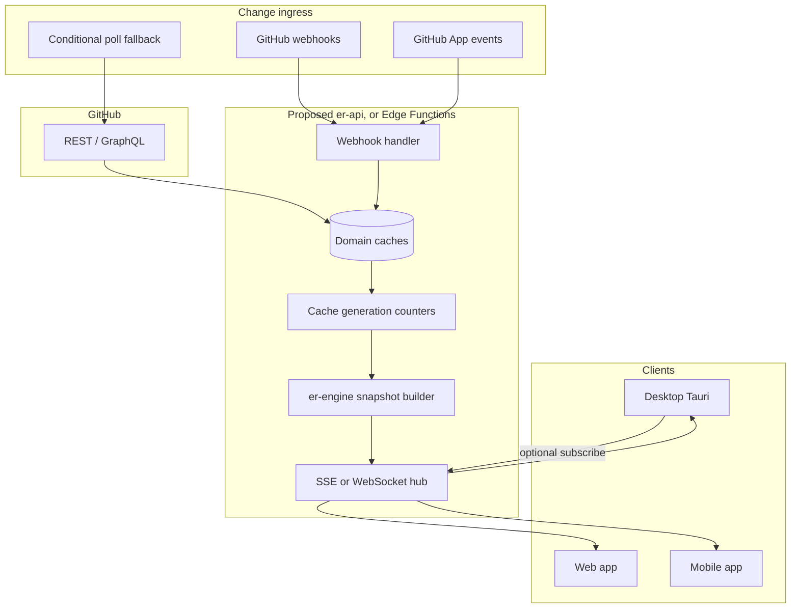

# GitHub sync architecture — deferred design

> **Status: not implemented.** Design reference for web/mobile and a possible hosted API path. No `er-api`, no `er-github`, no webhook receiver, no SSE hub.
> **Last updated:** 2026-09-13
> **Related:** [mobile-port.md](./mobile-port.md), [platform-strategy.md](./platform-strategy.md), ADR 0011 (push, not poll), ADR 0016 (content and chrome revisions), ADR 0026 (`gh` CLI)

Desktop GitHub access shells out to `gh`, which no hosted surface can inherit (ADR 0026). Web and mobile need token-based API access and a sync model that does not refetch on a timer. This document is that design. Two parts of it already ship, because neither depended on transport: pushed revisions (ADR 0011) and the content/chrome/reviewed split (ADR 0016).

---

## Lesson from idle profiling (May 2026)

`ER_DESKTOP_PROFILE_POLL=1` on an idle branch: the meta git sweep dominated background cost, and the poll revision advanced on each of its ticks while the diff hash was unchanged — chrome state was hashed into the counter the diff used.

**Implication:** a REST/GraphQL client that refetches the PR list on a timer churns exactly as the CLI does. An API buys batching, readable rate limits and web/mobile viability; **invalidation and push** buy idle CPU, and desktop already took those (ADR 0011, ADR 0016).

---

## Goals

- Web/mobile PR review, no subprocess: OAuth token in Keychain / Keystore.
- No snapshot rebuild when only sidebar chrome changed.
- `gh` stays the desktop default until an HTTP transport proves parity.
- Same UX contract: `AppSnapshot` plus revision, unchanged revision answered `snapshot: null`.
- Keep `REMOTE_PR_MAX_*` semantics; server-side diff generation is an option for huge PRs.

---

## Architecture overview (target)

```mermaid
flowchart TB
  subgraph clients [Clients]
    Desktop[Desktop Tauri]
    Web[Web app]
    Mobile[Mobile app]
  end

  subgraph ingress [Change ingress]
    WH[GitHub webhooks]
    AppEvt[GitHub App events]
    PollFallback[Conditional poll fallback]
  end

  subgraph erCloud [Proposed er-api, or Edge Functions]
    WHIn[Webhook handler]
    Cache[(Domain caches)]
    Gen[Cache generation counters]
    Engine[er-engine snapshot builder]
    Hub[SSE or WebSocket hub]
  end

  subgraph github [GitHub]
    API[REST / GraphQL]
  end

  WH --> WHIn
  AppEvt --> WHIn
  API --> Cache
  PollFallback --> API
  WHIn --> Cache
  Cache --> Gen
  Gen --> Engine
  Engine --> Hub
  Hub --> Desktop
  Hub --> Web
  Hub --> Mobile
  Desktop -->|optional subscribe| Hub
```

Local git (branches, worktrees, file watch, meta cache) stays desktop-only. The multi-project meta git loop still runs on a remote-only tab — it just halves its cadence (120s instead of 60s), so a remote tab is quieter rather than silent. That sweep is the dominant background cost the profiling section below is about, so do not read "remote" as "no local git work".

---

## Sync patterns

| Pattern | Use in er | Tradeoffs |
|---------|-----------|-----------|
| **GitHub webhooks** | PR opened/updated, push, review, review comment, check run | Needs an HTTPS endpoint; org/repo install; replay and idempotency |
| **SSE / WebSocket from the API** | Push `revision` (later, patches) to clients | Replaces desktop `er://revision` for all surfaces; connection auth |
| **ETag / If-None-Match** | PR list, check runs, comment threads | Cheap "unchanged" without webhooks; pair with a long TTL |
| **GraphQL batched query** | One round-trip: PR + checks + review decision | Good for open-PR detail; subscriptions limited |
| **Client poll + backoff** | Offline, webhook gap | 30–600s idle, not 5s; exponential backoff on 403 rate limit |

Recommended hybrid: webhooks (or a GitHub App) → server cache → SSE `revision`; clients use conditional GET on reconnect or after a missed webhook.

---

## Cache generations

A bump must invalidate only the domains that changed. ADR 0016 splits the desktop revision into three counters; a hosted service needs the same split per domain, since different events feed each one.

| Domain | Bumped by | Snapshot impact |
|--------|-----------|-----------------|
| PR list | `pull_request`, manual refresh, ETag miss | Sidebar rows only |
| PR status | `check_run`, `pull_request_review`, refresh | Status badges, mergeable, checks |
| Review comments | `pull_request_review_comment`, sync | Thread list, diff anchors |
| Diff content | Push to PR head, local git watch (desktop) | File hunks |
| Local meta | Branch checkout, desktop git only | Branch picker; no diff rebuild |

**Rule:** bump only the generations that changed, and answer `snapshot: null` when neither diff content nor UI-relevant chrome moved.

Fingerprint inputs must be stable — ids, branch names, counts. Timestamps or collection ordering flip a fingerprint every tick with nothing user-visible behind it: indistinguishable from a real change, and it pays for a full rebuild.

---

## GitHub webhook events (initial set)

| Event | Domain | Client-visible effect |
|-------|--------|-----------------------|
| `pull_request` | PR list, optional status | Sidebar PR row update |
| `push` (PR head branch) | Diff | Refresh diff if a tab is open on that PR |
| `pull_request_review` | Status | Review decision chips |
| `pull_request_review_comment` | Comments | Thread list, inline anchors |
| `check_run` / `status` | Status | CI aggregate in PR overview |
| `installation` / `installation_repositories` | PR list | Org scope for a GitHub App |

Handler flow: verify `X-Hub-Signature-256`; map the delivery to repo slug + PR number; patch the cache entry or enqueue a fetch; increment the domain generation; notify subscribers `{ type: "revision", generations: { pr_list: 12, … } }`.

---

## CLI vs token transport

| | `gh` CLI (today) | GitHub REST/GraphQL |
|--|------------------|---------------------|
| Desktop | Works with `gh auth login` | Optional |
| Web / mobile | Not viable — no subprocess, no user session to inherit | Required |
| Batching | One subprocess per call | GraphQL single query |
| Rate limits | Opaque; nothing in the engine reports quota failure | `X-RateLimit-*`, `retry-after` |
| Large diffs | `gh pr diff`, clone fallback | Compare API / diff media type; server generation for huge PRs |
| Auth | Whatever the CLI already has | OAuth PKCE / device flow; Keychain / Keystore |

The CLI's value is the token it never needs (ADR 0026). A hosted front end pays for an OAuth app plus per-platform token storage and refresh instead — the cost that keeps `gh` the desktop default until a second surface exists.

Intended shape: one transport seam in the engine, `gh` subprocess default, HTTP behind it. Anchor resolution stays above the seam; a second transport must not re-derive comment anchors against the diff.

---

## Client snapshot transport (web/mobile)

- `GET /v1/snapshot?revision={last}` → `{ revision, snapshot: null | AppSnapshot }`
- A `revision` event makes the client poll once, as `er://revision` plus `poll` does today.
- Later: patch events for sidebar-only fields, so a chrome change never re-serializes the diff payload (the desktop merges chrome-only responses over hunks it holds — ADR 0016).

Diff parsing stays in er-engine: server-side, or WASM/FFI on device ([mobile-port.md](./mobile-port.md) §2).

---

## Phased implementation

| Phase | Deliverable | Status |
|-------|-------------|--------|
| **0** | Idle CPU: revision decoupling, push, content/chrome split | Landed (ADR 0011, ADR 0016) |
| **1** | HTTP transport behind a feature flag | Not started |
| **2** | Per-domain cache generations | Not started |
| **3** | Webhook receiver + `er_*` cache tables | Not started |
| **4** | SSE hub + OAuth in the web/mobile shell | Not started |
| **5** | Snapshot patches / GraphQL optimization | Not started |

The GitHub API layer is roughly 35% of the mobile port ([mobile-port.md](./mobile-port.md)).

---

## Open decisions

1. **Thin client vs hosted API** — A thin client talks to GitHub directly (simpler ops, token on device); a hosted service preserves a single anchor/parse source and enables webhook fan-in.
2. **GitHub App vs OAuth app** — App for org webhooks; OAuth for user-scoped review of any repo the user can reach.
3. **Diff through the server** — Employer-repo compliance may forbid diffs passing through a hosted API: client-only GitHub fetch vs server-side cache.
4. **Desktop after the API** — Keep `gh` as default, run dual transport, or deprecate the CLI once parity is proven.

---

## References

- [`crates/er-engine/src/github.rs`](../crates/er-engine/src/github.rs) — `gh` wrapper
- [`crates/er-engine/src/app/state/github_sync.rs`](../crates/er-engine/src/app/state/github_sync.rs) — comment sync and anchor resolution
- [`crates/er-desktop/src/commands.rs`](../crates/er-desktop/src/commands.rs) — revision counters and `poll`
- [`crates/er-desktop/src/snapshot.rs`](../crates/er-desktop/src/snapshot.rs) — snapshot builder, meta fingerprint
- [`pr_cache.rs`](../crates/er-desktop/src/pr_cache.rs), [`gh_status_cache.rs`](../crates/er-desktop/src/gh_status_cache.rs) — TTL-gated chrome caches
- `ER_DESKTOP_PROFILE_POLL=1` → [`profile_log.rs`](../crates/er-desktop/src/profile_log.rs)
