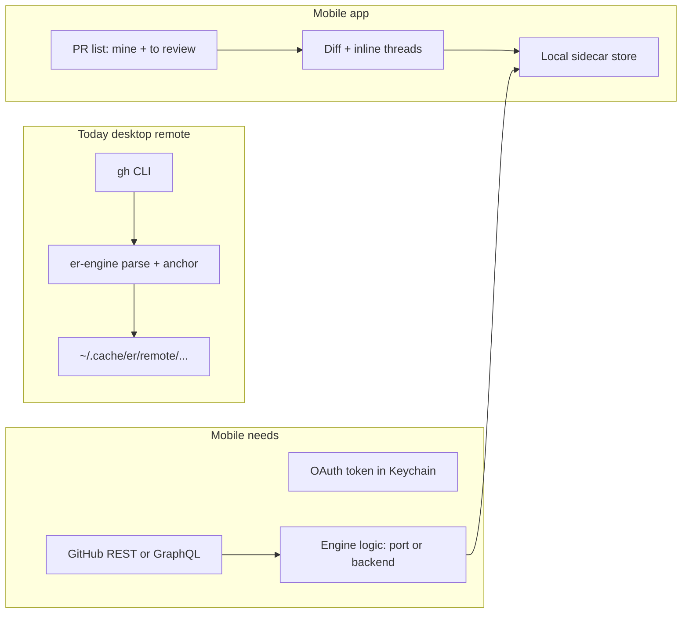
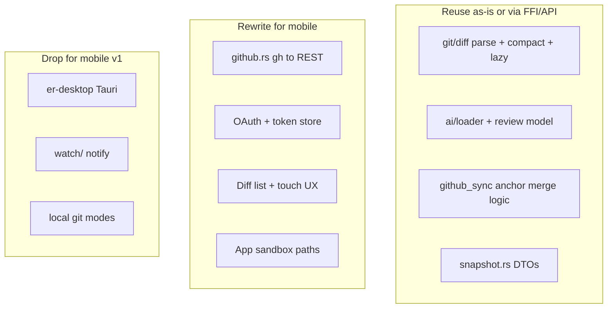

# Mobile port — complexity assessment

**Status:** Draft (planning)  
**Last updated:** 2026-05-25

---

## Scope (proposed)

Mobile easy-review would **not** include tracked branches or local git workflows. It would focus on:

- PR list: **my PRs** and **PRs to review**
- Open PR → diff review
- GitHub comments (pull/push/sync)
- Personal questions (`.er/questions.json`)
- AI review artifacts (read and/or run — see [AI Review](#3-ai-review-read-vs-run-product-decision))

Most other review features can follow desktop remote-PR behavior where applicable.

---

## Good news: scope matches an existing code path

Desktop and TUI already support **remote PR review without a local clone** via `TabState::new_remote` ([`crates/er-engine/src/app/state/mod.rs`](../crates/er-engine/src/app/state/mod.rs)) and `github::gh_pr_diff_remote` ([`crates/er-engine/src/github.rs`](../crates/er-engine/src/github.rs)). That path:

- Fetches diff via `gh pr diff --repo owner/repo`
- Hides branch/worktree modes when `is_remote()` (`visible_modes` in engine)
- Stores sidecars under `~/.cache/er/remote/{owner-repo}-{N}/` (`comments_dir_legacy`)
- Runs AI agents from the cache dir, not the repo (`spawn_agent_prompt` — `work_dir = er_dir` when remote)

Mobile scope is essentially **productizing remote mode**, not inventing a new review model.

---

## What maps cleanly (lower complexity)

| Feature | Existing foundation | Mobile note |
|---------|-------------------|-------------|
| PR list (my PRs / to review) | `pr_cache.rs` + `my_prs` / `prs_to_review` in `AppSnapshot` | Reimplement list fetch via GitHub API; same UX buckets |
| Open PR diff | `gh_pr_diff_remote` + unified diff parser in `git/diff.rs` | Port parser to mobile **or** expose via backend; lazy file parse already exists |
| Inline GH comments | `github_sync.rs` pull/merge/push | Replace `gh pr comment` calls with REST; **anchor resolution** (hunk content match) stays the same |
| Questions | `.er/questions.json` read/write in engine | Same JSON schema in app sandbox |
| AI findings (read) | `ai/loader.rs` + `review.json` staleness via diff hash | Works if sidecar dir is populated (sync from desktop, CI, or cloud run) |
| PR overview / CI | `gh pr view` / `gh pr checks` in `github.rs` | Straightforward API equivalents |
| Staleness | Per-comment `line_content` + SHA-256 `diff_hash` | Unchanged semantics |
| Large diff UX | `SNAPSHOT_DIFF_LINE_BUDGET` (15k), `is_lazy_stub`, viewport lazy load in desktop-ui | Mobile must virtualize lists (`diffRenderModel.ts` is the reference) |

Dropping tracked branches removes entire subsystems: **file watch**, staging/commit/history, worktrees, local `open_in_editor`, watched files, merge/conflict modes, and `projects.json` branch tracking.

---

## Major complexity areas (ordered by impact)

### 1. GitHub access: `gh` CLI is not portable (highest)

Almost all GitHub I/O lives in [`crates/er-engine/src/github.rs`](../crates/er-engine/src/github.rs) as **subprocess calls to `gh`**, including:

- PR diff, metadata, checks, review threads, comment create/reply/delete
- Size guard `REMOTE_PR_MAX_*` before fetch
- Fallback for huge PRs: **temporary shallow git clone** (`gh_pr_diff_via_clone`) — not viable on-device

**Mobile must:**

- OAuth / device flow + secure token storage (Keychain/Keystore)
- Rewrite or wrap ~30 `gh_*` operations as GitHub REST/GraphQL
- Handle rate limits, pagination, and error shapes differently than CLI
- Decide policy for oversized PRs (reject like today, or server-side diff generation)

This is the largest **new surface area**; remote tab logic is fine, the transport layer is not.

### 2. Where `er-engine` runs: three viable architectures

| Approach | Pros | Cons |
|----------|------|------|
| **A. Cloud API** (Rust service: `App` + `build_snapshot`) | Maximum parity with desktop; keeps diff parse, anchors, sidecar rules; AI can run server-side | Hosting, auth, latency, privacy/compliance |
| **B. Rust core on device** (UniFFI / FFI into iOS/Android) | Offline-friendly; no server | Heavy build pipeline; still no `gh`/Claude CLI on device |
| **C. Native app + reimplemented logic** | Best platform UX | Duplicates `github.rs`, `github_sync.rs`, AI loader — drift risk |

**Pragmatic path:** start with **A** for parity and speed; extract a shared `er-api` crate later if you want offline caches on device.

Desktop already proves the contract: `AppSnapshot` ([`crates/er-desktop/src/snapshot.rs`](../crates/er-desktop/src/snapshot.rs)) + revision/poll pattern in `commands.rs`. Mobile client ≈ new frontend over HTTP/WebSocket instead of Tauri `invoke`.

### 3. AI Review: read vs run (product decision)

**Read AI findings** — straightforward: same files as desktop managed/remote dirs (`review.json`, experts, professor output). Poll mtimes / diff hash like `check_ai_files_changed`.

**Run AI review on mobile** — hard today because `spawn_agent_prompt` ([`crates/er-engine/src/app/state/comments.rs`](../crates/er-engine/src/app/state/comments.rs)):

- Spawns local `claude` (or configured) subprocess
- Expects agent to write into `.er/` with tool rules (`Bash(gh pr *)`, etc.)
- iOS/Android cannot rely on user-installed Claude Code CLI

Options:

- **Read-only mobile** — review runs on desktop/CI; mobile consumes results (simplest)
- **Cloud-run review** — backend runs same prompts/skills; mobile triggers job + polls (matches desktop background tasks)
- **On-device LLM API** — replace subprocess with HTTP to Anthropic/OpenAI; **skills/prompts need adaptation** (no filesystem tools; diff must be inlined in prompt)

Skills under [`skills/`](../skills/) assume Claude Code + repo/cache layout — not drop-in on mobile without a runner service.

### 4. Storage and sync (medium)

Desktop uses layered roots (`ErRoot` in [`crates/er-engine/src/paths.rs`](../crates/er-engine/src/paths.rs)):

- Repo `.er/` (TUI)
- Managed app support dirs (desktop)
- `~/.cache/er/remote/...` (remote PR)

Mobile needs:

- Per-PR sandbox: `questions.json`, `github-comments.json`, `review.json`, `reviewed` state
- Migration/sync if user reviews same PR on desktop and phone (conflict resolution on `diff_hash` + comment IDs)
- Optional: iCloud/Android backup of sidecars (not in codebase today)

Comment sync already uses **tab identity** (`tab_key`) to avoid races during background pull — mobile should preserve that pattern for concurrent tabs/screens.

### 5. Diff UI on small screens (medium–high UX)

Reuse **concepts** from `desktop-ui` (flat rows, virtual scroll, inline `FindingRow` / `ThreadRow`), but not the Svelte/Tauri stack:

- Touch targets for line vs hunk comments
- Keyboard-less navigation (file list drawer, swipe between files)
- Syntax highlighting: desktop uses Shiki in a Web Worker — mobile needs native or lightweight highlighter; budget large files
- Split diff / blame / heatmap (v2 desktop features) — likely defer on mobile

### 6. Background sync and freshness (medium)

Desktop loops (`er-desktop/src/main.rs`): ~45s comment sync, ~60s remote diff refresh (`head_oid` dedup in `remote_diff_sync.rs`).

Mobile constraints:

- No always-on subprocess; use **foreground refresh + push notifications** (PR updated, review requested)
- iOS background execution limits
- Offline: show cached diff with stale banner (same as desktop staleness UX)

### 7. Features to explicitly cut or defer (lowers scope)

Safe to omit for v1 mobile (desktop-only or local-git-only):

- Browser panel + UI annotations (`browser_*`, `ui-annotations.json`)
- Embedded terminal (`terminal_*`)
- `open_in_editor` / worktree checkout (replace with “Open in GitHub” deep link)
- Commit composer, staging, watch mode, export-to-agent file copy
- Multi-worktree tabs, tracked branches, inbox from local agents

Still valuable on mobile if API-backed: **submit PR review** (approve/comment), **push comments** — already in engine via `gh pr review` wrappers.

---

## Suggested phased delivery

**Phase 1 — Read-heavy reviewer (lowest risk)**  
PR list → open PR → virtualized diff → pull GH comments → local questions → display AI findings if present. GitHub OAuth + REST diff. No on-device AI generation.

**Phase 2 — Write path**  
Add/reply/delete comments, push to GitHub, resolve threads, submit review decision. Background refresh on app resume.

**Phase 3 — AI parity**  
Cloud job runner for `/er-review` skills OR sync sidecars from desktop; optional “Run review” button hitting backend.

**Phase 4 — Polish**  
Saved PRs, notifications, multi-org accounts, conflict-aware sidecar sync across devices.

---

## Reuse map (what to port vs share)

---

## Open decisions (affect cost 2–5x)

1. **Platform:** Native vs cross-platform — cross-platform can share TypeScript types from `desktop-ui/src/lib/types.ts` but still needs native diff list performance.
2. **AI on mobile:** Read-only vs cloud-run vs on-device API — read-only avoids subprocess/skills problem entirely.
3. **Backend:** None (thin client + GitHub API only) vs hosted `er-engine` — thin client duplicates anchor/parse logic; backend preserves single source of truth.
4. **Privacy:** Whether PR diffs and comments pass through your server (compliance for employer repos).

---

## Bottom line

Supporting easy-review on mobile is **feasible and aligned** with existing remote PR architecture, but it is **not** a small port of the desktop app. The product scope described removes the hardest local-git features; the real work is:

1. Replacing **`gh` CLI** with token-based GitHub API
2. Choosing **where engine + AI run** (cloud strongly recommended for review generation)
3. Building a **touch-first diff/comment UI** with the same virtualized/lazy patterns as desktop
4. Defining **sidecar sync** across desktop and mobile for the same PR

Estimated relative effort (rough): GitHub API layer (35%) · mobile diff/comment UI (30%) · storage/sync (15%) · AI strategy (15%) · auth/accounts/notifications (5%).

---

## Planning checklist

- [ ] Read [github-sync-architecture.md](./github-sync-architecture.md) (webhooks, SSE, cache generations, `er-github` phases)
- [ ] Decide: native vs cross-platform; thin GitHub client vs hosted er-engine API
- [ ] Decide AI strategy: read-only sidecars vs cloud-run review vs on-device LLM API
- [ ] Design GitHub REST/GraphQL module replacing gh subprocesses (see [github-sync-architecture.md](./github-sync-architecture.md))
- [ ] Extract `AppSnapshot` + poll/revision contract as shared mobile API (from `snapshot.rs`)
- [ ] Spec touch diff UI: virtualized hunks, lazy files, inline threads/findings
- [ ] Define per-PR sandbox paths and optional cross-device sync for questions/github-comments/review.json
- [ ] Document v1 exclusions: watch, branches, editor, browser, terminal, commit
