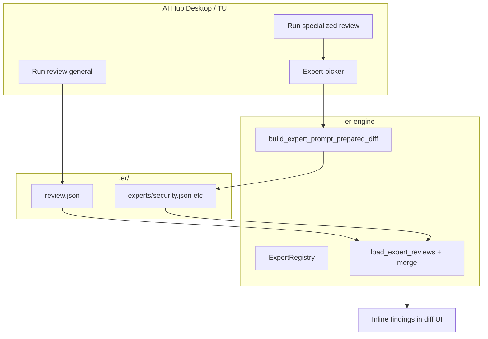

<!-- 24fe06da-09ed-46d6-9ef8-e2fbfef7fb24 -->
---
todos:
  - id: "shared-review-rules"
    content: "Add REVIEW_RULES.md + review_rules_preamble(); align Rust/er-review with philosophy (no style flags); refactor general prompts"
    status: pending
  - id: "engine-experts"
    content: "Add ExpertReview types, EXPERTS registry, expert prompt builders, loader merge into ErReview"
    status: pending
  - id: "engine-spawn"
    content: "Add spawn_background_expert_review with kind expert:{id} for concurrent runs"
    status: pending
  - id: "desktop-cmd"
    content: "Add list_ai_experts + run_ai_expert_review Tauri commands"
    status: pending
  - id: "desktop-ui"
    content: "AI Hub: specialized submenu, expert picker, InlineFinding expert label"
    status: pending
  - id: "tui-hub"
    content: "TUI AI hub expert picker + spawn_agent_prompt for experts"
    status: pending
  - id: "skills"
    content: "Create 6 er-review-* skills + README + .claude/commands copies"
    status: pending
  - id: "docs-tests"
    content: "Update config-reference.md; unit tests for merge + prompts"
    status: pending
isProject: false
---
# Specialized Expert Reviewers

**Copies:** this file (repo) · `~/.cursor/plans/Expert-Review-Agents-24fe06da.plan.md` (Cursor plans)

**Naming convention (all projects):** Cursor plan filenames use hyphens, not spaces (e.g. `Expert-Review-Agents-….plan.md`).

## Goals

- **General review unchanged**: AI Hub **Run review** continues to spawn the full [`build_review_prompt_prepared_diff`](crates/er-engine/src/ai/prompts.rs) flow → `.er/review.json`, `.er/order.json`, `.er/checklist.json`, `.er/summary.md`.
- **New specialized path**: AI Hub **Run specialized review** opens an expert picker, then runs a focused agent with a narrow prompt and skill.
- **Pattern-consistency expert**: Dedicated **Patterns** reviewer that greps/reads similar code elsewhere and flags deviations from project conventions.
- **Claude Code parity**: New skills under [`skills/`](skills/) (and copies in [`.claude/commands/`](.claude/commands/)) for manual `/er-review-expert-*` use.

## Recommended experts (v1 registry)

| ID | Label | Focus |
|----|-------|--------|
| `security` | Security | AuthZ/authN, injection, secrets, unsafe defaults |
| `performance` | Performance | Hot paths, allocations, blocking I/O, unnecessary work |
| `reliability` | Reliability | Error handling, retries, timeouts, resource cleanup |
| `testing` | Testing | Assertion quality, missing negative cases ([`REVIEW_PHILOSOPHY.md`](skills/REVIEW_PHILOSOPHY.md) test rules) |
| `api` | API / contracts | Breaking changes, public surface, semver impact |
| `patterns` | Patterns | Consistency with existing code in the same module/package |

**Not listed in specialized menu**: `general` (that is the existing Run review).

## Shared review rules (all reviewers)

Experts and the general reviewer share one **rules preamble** before any specialized (or full) analysis. This is **not** a second agent run — it is a single canonical rules block injected into every prompt so behavior stays consistent.

### Source of truth

| Artifact | Role |
|----------|------|
| [`skills/REVIEW_PHILOSOPHY.md`](skills/REVIEW_PHILOSOPHY.md) | Severity model (P0/P1/P2), what-not-to-flag, test-quality rules (unchanged; referenced by rules) |
| **`skills/REVIEW_RULES.md`** (new) | **Canonical operational rules** — diff, hash/annotate, anchors, confidence/evidence, caps, allowed categories, speed |
| **`review_rules_preamble()`** in [`crates/er-engine/src/ai/prompts.rs`](crates/er-engine/src/ai/prompts.rs) | Same content as `REVIEW_RULES.md` for desktop/TUI spawn; unit test asserts key phrases match the markdown file |

### `REVIEW_RULES.md` content (v1)

**Diff and hash (fix skill/engine drift)**

- Two-dot diff only: `git diff <base>` — never `main...HEAD` (staleness mismatch)
- Always `--unified=20 --no-color --no-ext-diff` (match desktop; skill currently uses `--unified=3` in places — align up)
- Prepared-diff path (desktop): hash `{output_dir}/diff-tmp`; agent must not re-run `git diff`
- TUI/skill path: `git diff … > .er/diff-tmp` then hash

**Annotate and anchor (keep from current Rust prompt)**

- Awk-annotate → `[h<N> L<M>]` tags; read annotated diff
- Findings only on `+` / `-` lines; copy `hunk_index` / `line_start` from tags — never compute line numbers
- `outside_diff: false` on review pass; drop unanchored findings

**Philosophy embedded in rules (fix current Rust gap)**

- Include P0/P1/P2 ↔ `high`/`medium`/`low` mapping from [`REVIEW_PHILOSOPHY.md`](skills/REVIEW_PHILOSOPHY.md)
- **Do not flag:** naming, formatting, style preferences, import order, file moves without logic change, comment nits
- Gate: "Does this affect correctness, security, or reliability?" — if no, skip
- **Remove** current prompt lines that encourage style findings (`low = style`, category `style`)

**Confidence and verification (keep)**

- `confirmed` | `informational` | `tentative` + `verification_plan` + `evidence`
- Budget: ~5 reads per finding, ~30 total; short-circuit obvious issues

**Finding caps (tiered)**

| Reviewer | Per file | Total |
|----------|----------|-------|
| General | 3–4 | 15 |
| Expert | 2 | 10 |

**Allowed finding categories**

- General: `security`, `logic`, `performance`, `correctness`, `error-handling`, `testing`, `api` (no `style`)
- Expert: `category` field = expert id (`security`, `patterns`, …); only report issues in that lens

**Speed**

- General: target &lt;3 minutes
- Expert: target &lt;2 minutes (narrower scope, fewer outputs)

### Prompt assembly

**General** (`build_review_prompt*`):

```
review_rules_preamble()
+ general outputs (risk/summary/findings → review.json; order; checklist; summary.md)
```

**Expert** (`build_expert_review_prompt_prepared_diff`):

```
review_rules_preamble()
+ ## Expert lens: {label}
+ write only {output_dir}/experts/{id}.json (findings only; expert caps)
```

Optional v1.1: if `.er/review.json` exists with matching `diff_hash`, expert lens adds: read it and **do not duplicate** general findings; only net-new expert findings.

### Refactor and drift fixes (required in v1)

| Drift today | Fix |
|-------------|-----|
| Rust allows `style` / "low = style" | Remove; align with philosophy |
| `REVIEW_PHILOSOPHY` not in Rust prompts | Summarized inside `REVIEW_RULES` / preamble |
| `er-review` skill: no `confidence`/`evidence` in schema | Update skill finding schema to match [`Finding`](crates/er-engine/src/ai/review.rs) |
| `er-review` skill: `--unified=3` vs engine `--unified=20` | Standardize on 20 in shared rules |
| Duplicated guideline blocks in `build_review_prompt` vs `build_review_prompt_prepared_diff` | Single preamble function |

Refactor [`skills/er-review/SKILL.md`](skills/er-review/SKILL.md): open with "follow `REVIEW_RULES.md`" + link; keep skill-specific steps (incremental cache, feedback-aware, tool budget) in the skill body only.

## Architecture



### Output contract (experts only write findings)

New sidecar per expert: **`.er/experts/<expert-id>.json`**

```json
{
  "version": 1,
  "expert_id": "security",
  "diff_hash": "<sha256>",
  "diff_scope": "branch",
  "created_at": "<ISO8601>",
  "files": {
    "src/foo.rs": {
      "findings": [ /* same Finding shape as review.json */ ]
    }
  }
}
```

- No `order.json` / `checklist.json` / `summary.md` from experts (keeps runs fast and avoids overwriting general artifacts).
- Finding `category` = expert id; finding `id` prefixed (`sec-1`, `pat-2`) to avoid collisions when merged.

### Display (v1 default) — neither separate overlay nor replace

| UI surface | General review | Expert reviews |
|------------|----------------|----------------|
| **AI overlay / side panel** (`review.json`, order, checklist, `summary.md`) | **Unchanged** — only general run writes these | Experts do **not** write or replace these files |
| **Inline findings in diff** | Findings from `review.json` | **Additive** — expert findings merged at load time into the same inline banners |
| **On disk** | `.er/review.json` etc. | `.er/experts/{id}.json` — separate; general files never overwritten by experts |

**Experts do not get their own overlay mode** and **do not replace** the general overlay. You still run general review for order/checklist/summary and the main risk rollup; specialized runs add more inline finding cards (labeled e.g. "Security") on the same diff view.

If general review has not been run yet, expert findings still show inline after merge (loader may synthesize minimal per-file entries). Order/checklist/summary panels stay empty until general review runs.

*Follow-up (not v1)*: filter/toggle inline findings by expert; optional dedicated expert summary strip — not a full second overlay.

## 1. Engine: expert registry + prompts

**New file** [`crates/er-engine/src/ai/experts.rs`](crates/er-engine/src/ai/experts.rs)

- `ExpertId` enum or `&'static str` ids
- `ExpertDef { id, label, description, skill_name }`
- `EXPERTS: &[ExpertDef]` — single source of truth for UI lists

**Extend** [`crates/er-engine/src/ai/prompts.rs`](crates/er-engine/src/ai/prompts.rs)

- `review_rules_preamble(output_dir: &str, prepared_diff: bool, caps: FindingCaps) -> String` — implements `REVIEW_RULES.md` (general vs expert caps)
- Refactor `build_review_prompt*` → preamble + general output section (no duplicated guidelines)
- `build_expert_review_prompt_prepared_diff(scope, output_dir, expert_id) -> String` → preamble + expert lens + `experts/{id}.json` only
- Test: `review_rules_preamble` does not contain `style` as allowed category; contains P0/P1/P2 and two-dot diff rule
- **Patterns** prompt explicitly requires:
  - Identify symbols/patterns introduced in the diff
  - `grep` / read 2–5 similar usages elsewhere in the repo (same directory or module first)
  - Flag only deviations that matter for correctness/maintainability (per philosophy — no style/naming nitpicks)
  - Cite `evidence` entries pointing at the established pattern file/range

**New types** in [`crates/er-engine/src/ai/review.rs`](crates/er-engine/src/ai/review.rs) (or `experts.rs`):

- `ExpertReview`, `ExpertFileReview` (serde)

**Extend** [`crates/er-engine/src/ai/loader.rs`](crates/er-engine/src/ai/loader.rs)

- `load_expert_reviews(er_dir) -> Vec<ExpertReview>`
- `merge_experts_into_review(review: &mut ErReview, experts: &[ExpertReview], current_diff_hash)` — skip stale files; prefix ids; attach findings to matching file paths (create minimal file entry if general review lacks that file)

**Background tasks** [`crates/er-engine/src/app/state/background.rs`](crates/er-engine/src/app/state/background.rs) + [`comments.rs`](crates/er-engine/src/app/state/comments.rs)

- Parameterize task `kind` as `expert:{id}` (not `"review"`) so **general + multiple experts can run concurrently** on the same branch/scope
- `spawn_background_expert_review(target, expert_id, prompt)` — same thread/prepared-diff path as `spawn_background_review`, different kind label for UI (`"Security review"` in background task list)

## 2. Desktop: command + AI Hub UI

**New Tauri command** in [`crates/er-desktop/src/commands.rs`](crates/er-desktop/src/commands.rs)

- `list_ai_experts() -> Vec<ExpertInfo { id, label, description }>` (from registry)
- `run_ai_expert_review(scope, expert_id)` — mirror `run_ai_review`: write `diff-tmp`, build expert prompt, `spawn_background_expert_review`
- Register in [`main.rs`](crates/er-desktop/src/main.rs) + [`permissions/app-commands.toml`](crates/er-desktop/permissions/app-commands.toml)

**AI Hub** [`desktop-ui/src/lib/components/AiActionPalette.svelte`](desktop-ui/src/lib/components/AiActionPalette.svelte)

- Extend `SubView`: `"main" | "providers" | "models" | "experts"`
- Rename/clarify existing item: **Run review** → description mentions *general / full review*
- New item: **Run specialized review** → `subView = "experts"`, load experts via `list_ai_experts`
- On select: `app.cmd("run_ai_expert_review", { scope, expertId })`
- Wire [`app.svelte.ts`](desktop-ui/src/lib/stores/app.svelte.ts) toast: `"Security review started"` etc.; close palette on run (same as `run_ai_review`)

**Types** [`desktop-ui/src/lib/types.ts`](desktop-ui/src/lib/types.ts): `ExpertInfo` interface

## 3. TUI: AI hub parity

[`crates/er-engine/src/app/state/mod.rs`](crates/er-engine/src/app/state/mod.rs)

- `HubKind::AiExpert`
- `AiActionKind::ExpertReview { expert_id: String }` (or separate hub action)
- `open_ai_expert_picker()` — list from `EXPERTS`
- `open_ai_hub()`: add **Specialized review** item before provider picker

[`crates/er-tui/src/input/mod.rs`](crates/er-tui/src/input/mod.rs)

- Handle expert selection → `build_expert_review_prompt(...)` + `spawn_agent_prompt` with command name `expert-{id}` (tab-local; acceptable for TUI v1)

## 4. Skills (Claude Code)

Create one skill per expert (discoverable commands), following [`skills/er-review/SKILL.md`](skills/er-review/SKILL.md) structure but scoped:

| Skill dir | Trigger | Writes |
|-----------|---------|--------|
| `skills/er-review-security/` | `/er-review-security [scope]` | `.er/experts/security.json` |
| `skills/er-review-performance/` | `/er-review-performance` | `.er/experts/performance.json` |
| `skills/er-review-reliability/` | … | `.er/experts/reliability.json` |
| `skills/er-review-testing/` | … | `.er/experts/testing.json` |
| `skills/er-review-api/` | … | `.er/experts/api.json` |
| `skills/er-review-patterns/` | … | `.er/experts/patterns.json` |

Each expert skill:

- First section: **"Apply `REVIEW_RULES.md` in full before this expert lens"** (link to sibling file)
- Second section: expert lens only (scope, grep/read instructions for patterns, output path)
- Caps: 2 per file, 10 total (stated in lens)
- Same `Finding` JSON schema as general review (`confidence`, `evidence`, `outside_diff`, etc.)

Refactor **`er-review`** skill to use shared rules (see drift table above); keep skill-only content: incremental cache, feedback-aware, `scripts/er-*` tool budget.

Update [`skills/README.md`](skills/README.md) table + copy instructions.

Copy to `.claude/commands/` (same loop as existing skills).

## 5. Docs + gitignore

- Document experts in [`docs/config-reference.md`](docs/config-reference.md) (`.er/experts/` sidecars, merge behavior)
- Ensure `.er/experts/` is covered by existing `.er/` gitignore entry (already is)

## 6. Tests

- **Unit**: `review_rules_preamble` — no `style` category; includes philosophy gate and two-dot diff
- **Unit**: expert merge logic (id prefix, stale skip, file path merge) in `er-engine`
- **Unit**: each `build_expert_*` prompt contains expert lens + `experts/{id}.json` path + stricter caps than general
- **Unit**: general prompt still requests all four output files after refactor

## Out of scope (follow-ups)

- `[ai_hub.experts] enabled = [...]` in TOML (registry is hardcoded v1)
- Expert-specific validate pass
- Separate AI overlay panel per expert
- Merging expert runs into `review.json` on disk (merge is load-time only to avoid clobbering general review)

## File touch summary

| Area | Primary files |
|------|----------------|
| Shared rules | `skills/REVIEW_RULES.md`, `skills/REVIEW_PHILOSOPHY.md` (reference only), `prompts.rs` |
| Registry + merge | `crates/er-engine/src/ai/experts.rs`, `loader.rs`, `review.rs` |
| Prompts | `crates/er-engine/src/ai/prompts.rs` |
| Skill drift | `skills/er-review/SKILL.md` |
| Background spawn | `crates/er-engine/src/app/state/comments.rs`, `background.rs` |
| Desktop API | `crates/er-desktop/src/commands.rs`, `main.rs`, permissions |
| Desktop UI | `AiActionPalette.svelte`, `InlineFinding.svelte`, `types.ts`, `app.svelte.ts` |
| TUI | `app/state/mod.rs`, `er-tui/src/input/mod.rs` |
| Skills | `skills/er-review-*/SKILL.md`, `skills/README.md`, `.claude/commands/` |
