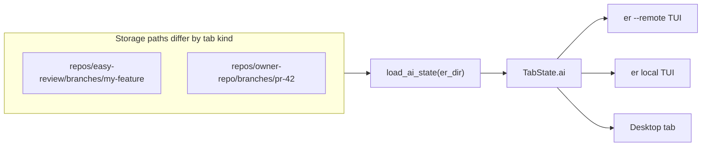

# TUI and Desktop: shared review storage (incl. `--remote`)

## Short answer

**Yes** — TUI and Desktop use the same `er_engine` loader (`load_ai_state`) and the same managed storage layout for `review.json`, `questions.json`, and `github-comments.json`.

**But** `er --remote` resolves a **different directory** than a local-clone Desktop tab on a feature branch. If Desktop wrote review data under `repos/<origin-basename>/branches/<branch>/` and you open the same PR with `er --remote`, TUI looks under `repos/<owner-repo>/branches/pr-<n>/` instead. That is the most likely explanation when Desktop shows findings and remote TUI does not (even with AI layer ON).

---

## Shared loader and files

| Artifact | File | Loader |
|----------|------|--------|
| AI findings | `review.json` (+ `experts/` merged at load) | [`load_ai_state`](crates/er-engine/src/ai/loader.rs) |
| Questions | `questions.json` | same |
| GitHub comments | `github-comments.json` | same |

Both apps: [`TabState::er_dir()`](crates/er-engine/src/app/state/mod.rs) → [`ErRoot::er_dir()`](crates/er-engine/src/paths.rs).

Default root: `~/.local/share/easy-review/repos/<repo_slug>/branches/<branch_slug>/`

Override: `ER_REPO_LOCAL=1` → `<cwd>/.er/` (debug; applies to that process only).



---

## `er --remote` behavior (TUI)

Entry: [`crates/er-tui/src/main.rs`](crates/er-tui/src/main.rs) — requires a GitHub PR URL; uses `gh` API (`gh pr diff --repo`), **no local clone**.

Tab construction: [`TabState::new_remote`](crates/er-engine/src/app/state/mod.rs):

- Sets `remote_repo: Some("owner/repo")`, `pr_number: Some(n)`, diff from `gh_pr_diff_remote`
- Calls `finish_storage_setup()` → `apply_managed_root()` but **does not** call `reload_ai_state()` on startup
- Main then calls `reload_remote_comments()` only (re-reads `github-comments.json`; does not load `review.json` by itself)

### Remote storage path (`apply_managed_root`)

When `remote_repo` + `pr_number` are set:

```
~/.local/share/easy-review/repos/<slug(owner/repo)>/branches/pr-<n>/
```

Example: `owner/repo` PR #42 → `repos/owner-repo/branches/pr-42/`

Unit test: [`comments_dir_returns_managed_path_in_remote_mode`](crates/er-engine/src/app/state/mod.rs).

This matches **Desktop remote PR tabs** (same `apply_managed_root` rules). It does **not** match **local-clone** tabs that store under `slug_repo(origin)` + branch name.

### Local clone path (for comparison)

```
~/.local/share/easy-review/repos/<slug(git remote origin basename)>/branches/<slug(branch)>/
```

Example: origin `…/easy-review.git`, branch `vilf/my-feature` → `repos/easy-review/branches/vilf-my-feature/`

`--pr` on a **local** TUI (without `--remote`) still uses this path — `remote_repo` stays `None`, `pr_number` alone does not switch to `pr-N` storage ([`comments_dir_uses_normal_mode_when_pr_number_missing`](crates/er-engine/src/app/state/mod.rs) only covers missing `pr_number`; local `--pr` has `pr_number` but not `remote_repo`, so branch-slug path applies).

---

## Remote-specific AI load / refresh (fixed)

| Event | Loads `review.json`? |
|-------|---------------------|
| `new_remote` / `new_remote_stub` startup | **Yes** — `reload_ai_state()` after `finish_storage_setup()` |
| `refresh_diff()` in remote tab | **Yes** on full refresh — `reload_ai_state()` + relocate + stale files before return |
| `apply_remote_diff_result` (background PR refresh) | **Yes** — same sidecar reload after diff apply |
| `check_ai_files_changed()` | Yes — when sidecar mtimes change |

Other remote differences:

- No file watcher (no `.er/` in repo to watch)
- No session auto-save on quit
- `storage_branch_scope()` is `None` → **no** `artifacts_branch_mismatch` guard (review is not dropped for `head_branch` mismatch)
- Branch-mismatch guard can still affect **local** tabs

---

## TUI display vs load (all modes, including `--remote`)

- **Load**: into `tab.ai` via `reload_ai_state` / polling
- **Inline findings**: `tab.layers.show_ai_findings` (`A` key) — default **ON** (matches Desktop inline behavior)

---

## Diagnosis checklist for `er --remote` + AI ON, no findings

1. **Path match** — Find where Desktop stored the review:
   - Desktop **remote PR tab**: `~/.local/share/easy-review/repos/owner-repo/branches/pr-N/review.json`
   - Desktop **local branch tab**: `…/repos/<origin-name>/branches/<branch>/review.json`
   - Remote TUI only sees the **first** path if review was written for that PR in managed `pr-N` storage.

2. **TUI loaded data?** — Status bar: **`AI ON`** badge requires `tab.ai.has_data()`. Side panel (`p`): file risk / findings list for `package.json`?

3. **Timing** — Wait ~1s after launch for initial `check_ai_files_changed`, or trigger reload via hub actions that call `reload_ai_state`.

4. **Same PR URL** — `--remote` must be the same `owner/repo` + PR number as the Desktop remote tab (resume hint prints `er --remote https://github.com/owner/repo/pull/N` on quit).

5. **Inline vs panel** — Data in panel but not inline → anchor mismatch (line/hunk); Desktop has `fallbackFindings`, TUI does not.

---

## Implemented fixes

- `reload_ai_state()` after `new_remote` / `new_remote_stub` setup
- Remote `refresh_diff_impl` and `apply_remote_diff_result` reload sidecars + relocate comments + stale files
- `show_ai_findings` defaults to `true`

## Remaining follow-ups (optional)

- Unify storage: same PR → same `pr-N` dir from local clone and `--remote`
- Show resolved `er_dir` in status bar or `ER_DEBUG` output
- Persist layer toggles in `session.json`

---

## Verification todos

- [ ] Compare Desktop tab type (remote PR vs local branch) to `ls ~/.local/share/easy-review/repos/*/branches/*/review.json`
- [ ] Remote TUI: confirm `AI ON` + panel findings after ~1s; note `er_dir` path for PR
- [ ] If review exists only under local branch dir, copy or re-run AI review targeting `pr-N` storage (or open Desktop remote PR tab)
